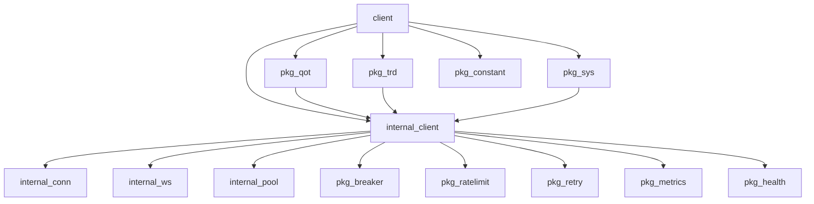

# futuapi4go Architecture

> Generated from knowledge graph analysis: 855 nodes, 850 edges, 36 communities

## Overview

futuapi4go is a Go client library for Futu OpenAPI (富途 OpenD). It provides a type-safe interface to Futu's trading and market data services over Protocol Buffers over TCP.

```mermaid
graph TB
    subgraph "Public API"
        CLI[client/client.go<br/>Main Client Type]
    end
    
    subgraph "Business Logic"
        QOT[pkg/qot<br/>Market Data APIs]
        TRD[pkg/trd<br/>Trading APIs]
        SYS[pkg/sys<br/>System APIs]
    end
    
    subgraph "Connection Layer"
        INT[internal/client<br/>Connection Mgmt]
        CONN[internal/client/conn<br/>TCP I/O]
        WS[internal/client/ws<br/>WebSocket]
    end
    
    subgraph "Infrastructure"
        POOL[internal/client/pool<br/>Connection Pool]
        BREAKER[/pkg/breaker<br/>Circuit Breaker]
        RATE[pkg/ratelimit<br/>Rate Limiting]
        RETRY[pkg/retry<br/>Retry Logic]
        METRICS[/pkg/metrics<br/>Observability]
    end
    
    CLI --> INT
    CLI --> QOT
    CLI --> TRD
    CLI --> SYS
    
    INT --> CONN
    INT --> WS
    INT --> POOL
    INT --> BREAKER
    INT --> RATE
    INT --> RETRY
    INT --> METRICS
```

## Functional Areas

### 1. Public API (client/client.go)
**Central hub with 200 edges**

The main `Client` type that wraps all functionality:
- `New()` / `Connect()` - Connection lifecycle
- `Trade()` - Trading API entry point
- `Quote()` - Market data entry point
- `System()` - System-level queries

### 2. Market Data (pkg/qot) - 127 edges
**Quote/market data APIs**

| Module | Purpose |
|--------|---------|
| `pkg/qot/quote.go` | Main quote APIs (GetBasicQot, Subscribe, GetKL, etc.) |
| `pkg/qot/market.go` | Market info (GetReference, GetMarketState, GetOwnerPlate) |
| `pkg/qot/history_kl_points.go` | Historical K-line points |
| `pkg/qot/iterator.go` | Iterator pattern for pagination |

### 3. Trading (pkg/trd) - 58 edges
**Trading operations**

| Module | Purpose |
|--------|---------|
| `pkg/trd/trade.go` | Core trading (PlaceOrder, ModifyOrder, CancelOrder) |
| `pkg/trd/convenience.go` | Quick trading helpers (QuickBuy, QuickSell) |
| `pkg/trd/builder.go` | Order builder pattern |

### 4. System APIs (pkg/sys)
**System-level queries (no account required)**

- `GetGlobalState` - Connection state
- `GetUserInfo` - User information
- `GetDelayStatistics` - API latency stats
- `Verification` - Verification APIs

### 5. Connection Management (internal/client)
**Core networking layer**

| Module | Purpose |
|--------|---------|
| `internal/client/client.go` | Main client, request/response handling |
| `internal/client/conn.go` | TCP connection, packet framing |
| `internal/client/ws.go` | WebSocket support |
| `internal/client/pool.go` | Connection pooling |

### 6. Infrastructure

| Module | Purpose |
|--------|---------|
| `pkg/breaker` | Circuit breaker for resilience |
| `pkg/ratelimit` | API rate limiting per proto ID |
| `pkg/retry` | Automatic retry with backoff |
| `pkg/metrics` | API call tracking, connection stats |
| `pkg/health` | Health check HTTP endpoint |
| `pkg/degradation` | Service degradation tracking |

### 7. Data Types & Utilities

| Module | Purpose |
|--------|---------|
| `pkg/option` | Option code parsing |
| `pkg/market` | Market hours (CN, HK, US) |
| `pkg/constant/errors` | Error types and helpers |
| `pkg/constant/validation` | Input validation |
| `pkg/util/code` | Stock code formatting |

## Key Execution Flows

### Flow 1: Connect to OpenD
```
client.New() 
  → internal/client.New() 
    → internal/client.Connect()
      → internal/client/conn.Dial() (TCP)
      → InitConnect handshake
      → AES key exchange
```

### Flow 2: Place Order
```
client.PlaceOrder() 
  → pkg/trd.PlaceOrder() 
    → internal/client.RequestContext()
      → internal/client.Request()
        → internal/client/conn.WritePacket()
        → internal/client/conn.ReadResponse()
```

### Flow 3: Subscribe to Quotes
```
client.Subscribe() 
  → pkg/qot.Subscribe() 
    → internal/client.Request()
    → SetPushHandler() 
      → pkg/push/chan.NewQuoteChannel()
        → real-time callbacks via conn
```

## Data Flow

```
┌─────────────┐     ┌─────────────┐     ┌─────────────┐
│   User      │────▶│   Client    │────▶│  Business  │
│   Code      │     │   (public)  │     │   Logic    │
└─────────────┘     └─────────────┘     └─────────────┘
                                               │
                    ┌─────────────┐            ▼
                    │  Protocol   │     ┌─────────────┐
                    │  Buffers    │◀───▶│  Internal  │
                    │  (pb/)      │     │   Client   │
                    └─────────────┘     └─────────────┘
                                               │
                    ┌─────────────┐            ▼
                    │ Futu OpenD  │◀───────────────┘
                    │  (TCP)      │
                    └─────────────┘
```

## Module Dependencies



## Graph Statistics

- **Total Nodes**: 855
- **Total Edges**: 850
- **Communities**: 36
- **Most Connected**: client (200), qot (127), futuapi (58), trd (58)

## Adding New APIs

See [AGENTS.md](AGENTS.md) for the complete procedure:

1. Confirm proto in `api/proto/`
2. Run `./scripts/regen-all-protos.ps1`
3. Add wrapper in `pkg/qot/` or `pkg/trd/`
4. Add public helper in `client/client.go` if needed
5. Add unit tests
6. Update `docs/CHANGELOG.md`

---

*Generated from graphify knowledge graph analysis*